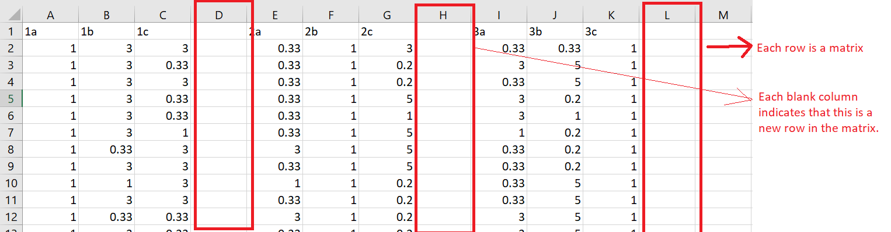

```javascript

const linearAlgebra = require('linear-algebra')();
const Matrix = linearAlgebra.Matrix; `
const csv = require('csvtojson');
	
const convert = require('matrixa');

```

```javascript

const math = require('mathjs');
const csv = require('csvtojson');
	
const convert = require('matrixa');

```

# toMatrixArray
[](https://badge.fury.io/js/recht)
[](https://raw.githubusercontent.com/dashersw/recht/master/LICENSE) [](https://greenkeeper.io/)

In areas like computational decision science and operation research it is common to work with collections of matrices. This package aims to provide a parser of csv that contains data from not one but several matrices.
So this is a simple library extension for csvtojson to parse that csv with an array of matrices into a usable object of mathjs or linear-algebra npm library.

## Installation

` npm i matrixa `

## Example Usage

```javascript
csv()
  .fromFile(csvFilePath)
  .then((jsonObj) => {
      

console.log(convert.toMatrixArray(jsonObj, 'mathjs')[1]);


  });
```

Returns:
```javascript
{ data: [ [ 1, 3, 0.33 ], [ 0.33, 1, 0.2 ], [ 3, 5, 1 ] ],
  rows: 3,
  cols: 3 }
```

```javascript
csv()
  .fromFile(csvFilePath)
  .then((jsonObj) => {
      

console.log(convert.toMatrixArray(jsonObj, 'linear-algebra')[1]);


  });
```

Returns:
```javascript
Matrix {
  _data: [ [ 1, 3, 0.33 ], [ 0.33, 1, 0.2 ], [ 3, 5, 1 ] ],
  _size: [ 3, 3 ],
  _datatype: undefined }
```


## Documentation

| Argument      | Description                                                                                                                                                                                               | Mandatory  | Type                    |  Rules                                                                                                                                                                                                                 |
|:-------------:|:---------------------------------------------------------------------------------------------------------------------------------------------------------------------------------------------------------:|:----------:|:-----------------------:|:----------------------------------------------------------------------------------------------------------------------------------------------------------------------------------------------------------------------:|
| jsonObj       | **jsonObj** is the json array that contains the data from the csv.                                                                                                                                        | True       | JSON Array              | Each row **MUST** contain the data of a matrix, rows separated by a blank column.                                                                                                                                      | 
| package       | **package** speficies which package you are using.                                                                                                                                                        | True       | String                  | This argument **MUST** be a string containing 'mathjs' or 'linear-algebra' depending on the package the user wants to use.                                                                                             |



## Package Dependencies

-   linear-algebra
-   mathjs
-   csvtomatrix

## License

MIT

## Contributing

<https://github.com/patelotech/toMatrixArray>

## Linting

-   AIRBNB
[AIRBNB JS CODE STYLE](https://dev.mysql.com/doc/ "AIRBNB JS CODE STYLE")

### Configuration

-   Eslint v-4.19.1 // AIRBNB Configuration

### Linting scripts

-   Error check: `npm run lint`
-   Error fix:  `npm run lint-fix` or `npm run lint -- --fix`

